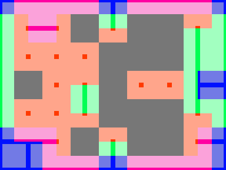
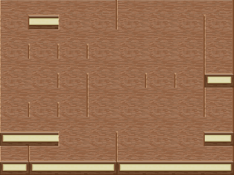

# Blob tileset generator

Blob tileset generator generates a [blob tileset](http://www.cr31.co.uk/stagecast/wang/blob.html) from a 1x5 tileset image. You can create a map with the generated blob tileset using [Tiled](https://www.mapeditor.org/).

## Usage

Prepare a 1x5 tileset image. Refer to [Wolf RPG Editor's FAQ](https://www.silversecond.com/WolfRPGEditor/Guide/MAKEMAT_004.html) for how each tile is used. Note that Blob tileset generator does not support animation tiles while Wolf RPG Editor does.

The 1x5 tileset image must satisfy that
- `width * 5 == height`.
- width is even.

Then, run the following command.

```
cabal run blob-tileset-generator.cabal -- <1x5 tileset image path>
```

For the available options, see `cabal run blob-tileset-generator.cabal -- --help`.

## Examples

|Input|Output|
|-----|------|
|||
|||

## Licenses

All files in this repository are licensed under The 3-Clause BSD License. See [LICENSE](LICENSE) for the full license texts.
